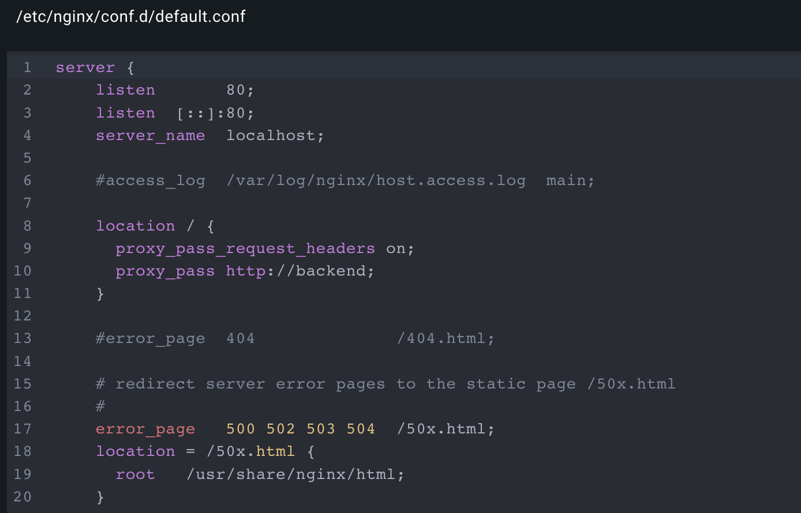
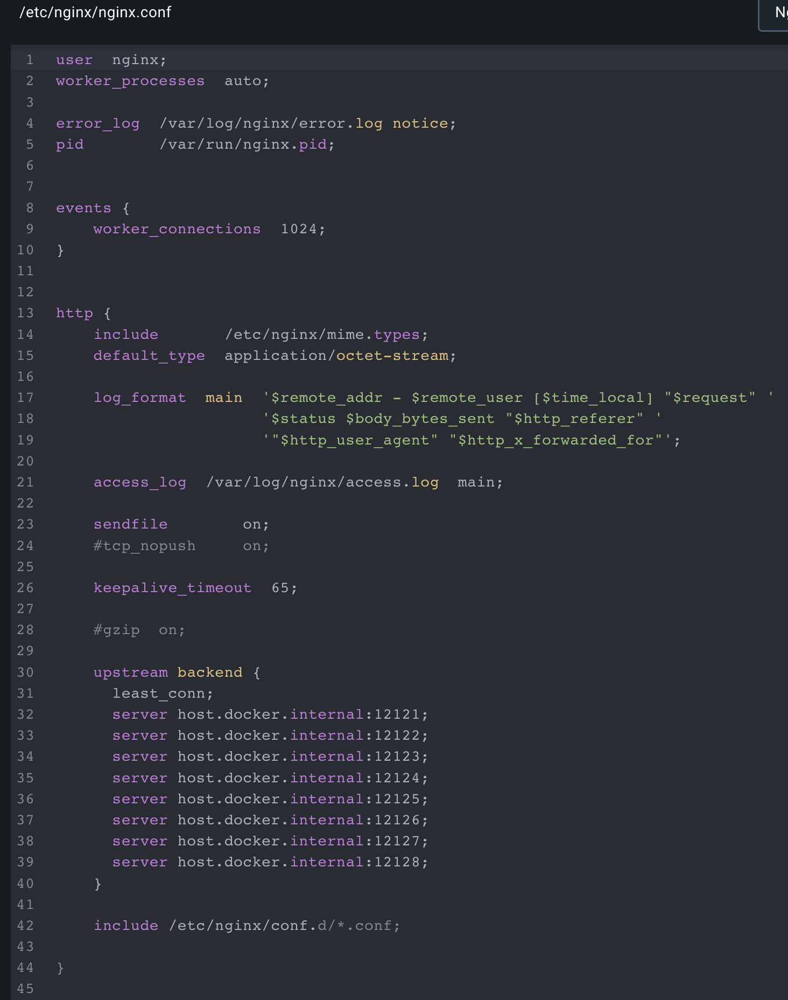
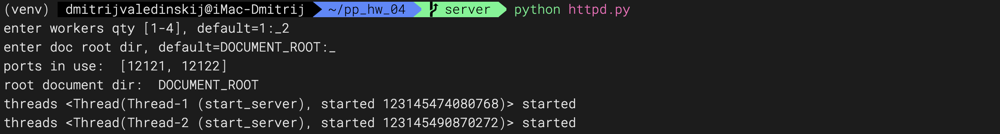
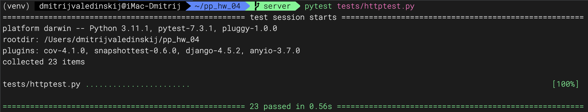
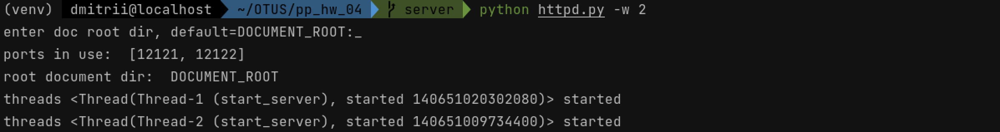
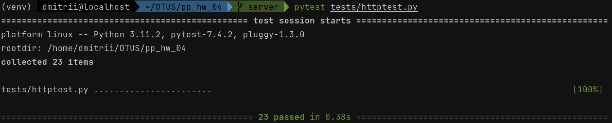
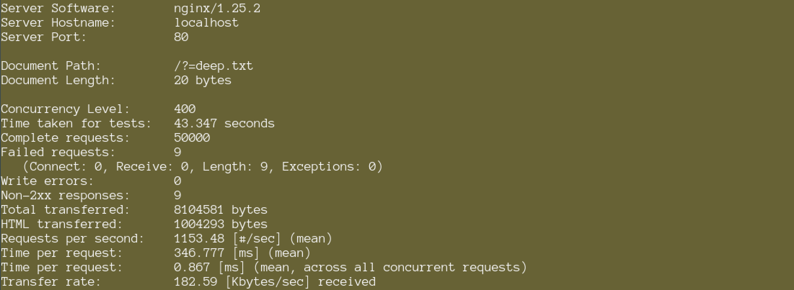
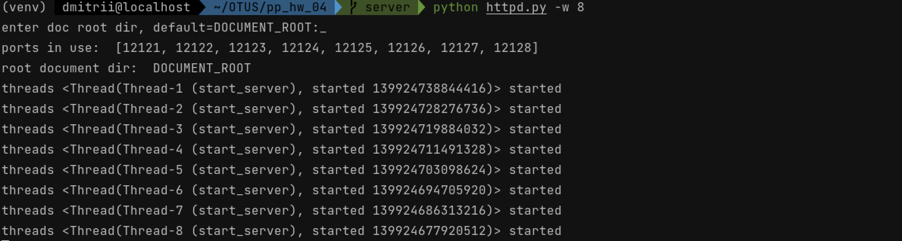
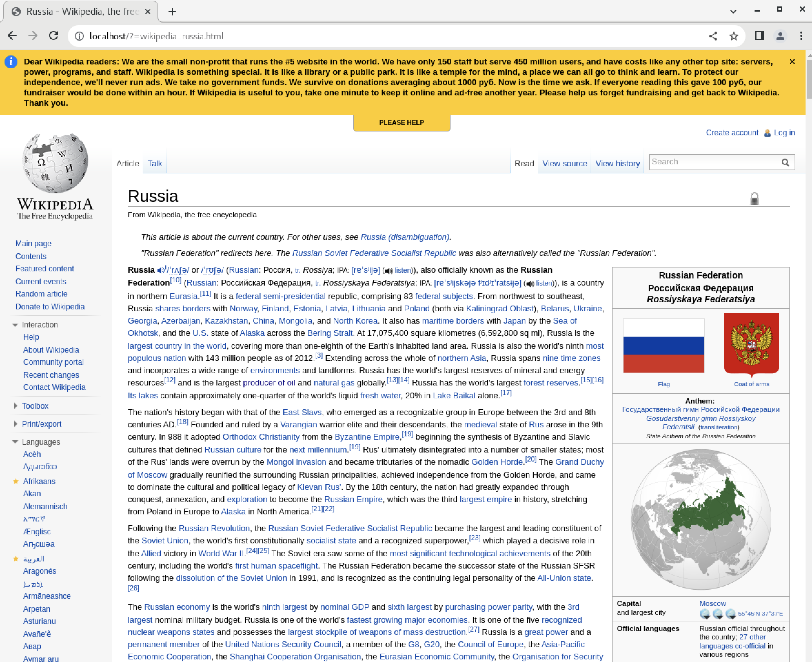

## ДЗ №4

### Web Server: выполнено.

Cвой масштабируемый сервер на "ванильном" Python, частично реализующий протокол HTTP.
Корректно отдает страницу wikipedia-russia. Выполнено нагрузочное тестирование.

### Архитектура

Threaded (количество потоков задает пользователь: 1-8) socket server with callbacks.
В этом решении для доступа к файлу достаточно ввести его название, относительный путь необязателен.
Для демонстрации работы многопоточного сервера использован балансировщик нагрузки nginx из docker-контейнера. 
Настройки балансировщика nginx отличаются для darwin и linux (Centos 7).
Нагрузочное ab тестирование проведено в среде ОС Centos 7 на VMware Fusion.
Docker-образы балансировщиков:
- dmvaled/bal - mac os (bal - balancer)
- dmvaled/cbal - Centos 7 (cbal - Centos balancer)

[](images/img_01.png)
[](images/img_02.png)

Запуская сервер пользователь выбирает количество потоков и корневую директорию хранилища файлов.
Отдельно запускаем контейнер с балансировщиком nginx из образа dmvaled/bal.

[](images/img_04.png)

Успешно проходим тесты:

[](images/img_03.png)

### Нагрузочное тестирование

Запускаем среду для нагрузочного тестирования:

[](images/img_06.png)

Запуск nginx контейнера в Centos 7:

```commandline
docker run --net=host -d --name cbal dmvaled/cbal
```

настройки nginx в cbal:

[](images/img_09.png)

Стартуем с двумя потоками:

[](images/img_07.png)

Проходим тесты:

[](images/img_08.png)

Нагружаем сервер легким файлом 8 потоков:

[](images/img_10.png)

Есть незначительные сбои в работе, но в общем неплохо:

[](images/img_11.png)

Работаем с 2 потоками:
Нагружаем сервер тяжелым файлом:

[](images/img_13.png)

Сбоев нет:

[](images/img_14.png)

Запускаем 8 потоков:

[](images/img_12.png)

Нагружаем сервер тяжелым файлом:

[](images/img_16.png)

Сбоев нет:

[](images/img_17.png)

Результаты тестирования относительны:
- зависят от ресурсов машины
- от конкуренции между apache и сервером

Рост нагрузочной способности на порядок при запуске новых потоков отлично виден.

### Отдача файлов

[](images/img_18.png)
[](images/img_19.png)
[](images/img_20.png)
